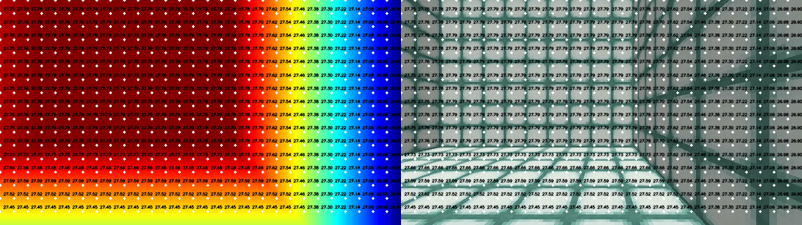
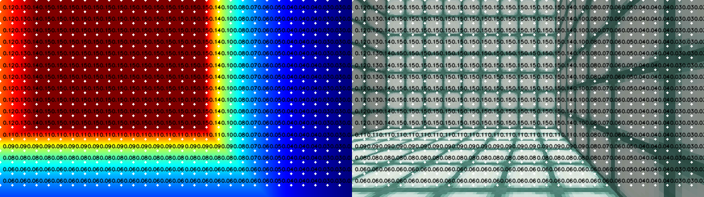

# Feature test examples
This directory contains feature test examples.

## depth.py
This script evaluates the raw depth buffer output from CraftGround. It creates an environment, captures depth values, and performs statistical analysis on the data. Additionally, it visualizes the depth distribution and saves depth-based video recordings for further inspection.

Key functionalities:

- Initializes a CraftGround environment with and without depth conversion.

- Collects depth data over multiple steps and ensures values remain within expected bounds.

- Visualizes depth statistics such as mean, standard deviation, min, and max depth values.

- Saves depth frames as grayscale and color-mapped videos for comparison.

## depth_precise.py
This script verifies the accuracy of the depth conversion implementation. Additionally, it utilizes the API to generate a test structure programmatically, leveraging the new NBT editing feature in CraftGround (available since version 2.6.8).

### No conversion mode
In this mode, raw depth buffer values are used without any transformation. This may result in non-linear depth representations.

### Conversion mode
CraftGround automatically converts depth buffer values into linear depth values using the following equation:

$$
d = \frac{2 \times \text{near} \times \text{far}}{\text{far} + \text{near} - z \times (\text{far} - \text{near})}
$$

where:

- `near = 0.05`
- `far = view distance * 4`

This conversion ensures a more accurate and linear depth representation.

### Conclusion
For more precise and linear depth values, it is recommended to use the conversion mode.